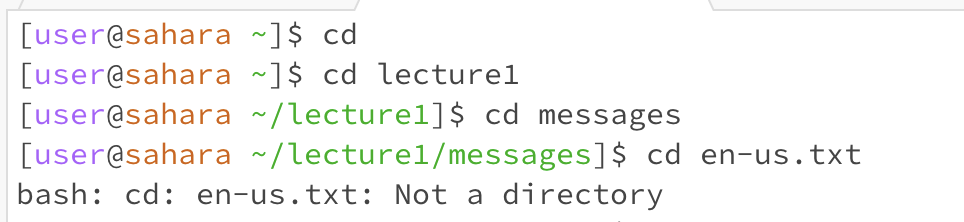
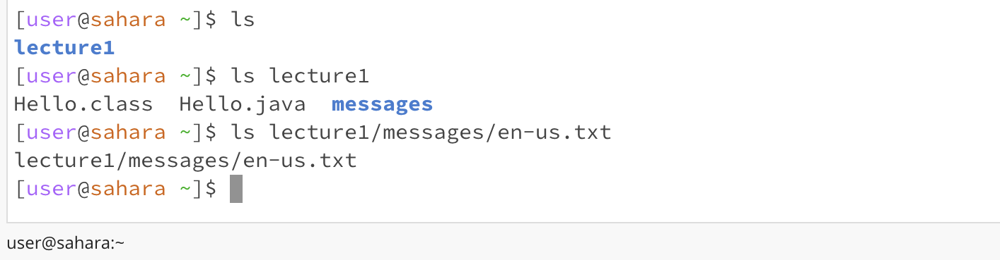
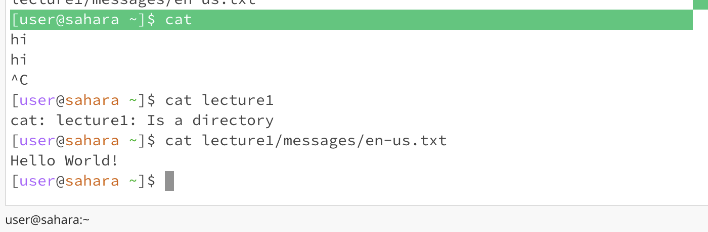

Lab Report 1

When running the `cd` command with no arguments, it changes the working directory to the home directory because no other is inputted; this can be used to reset the working directory. In the pictured case, the working directory begins at home and so cd has no affect, therefore it is not an error.

When running `cd` with a path to a directory, the working directory is set to the input directory. In the pictured case, the working directory begins at `home` and then changes to `home/lecture1`, meaning it did not result in an error.

When running `cd` with a path to a file, the error "not a directory" is printed because a file is not a directory and therefore cannot become the working directory. In the pictured case, the working directory begins at `home/lecture1/messages` and after running the path to en-us.txt, the error is printed.

When running the `ls` command with no arguments, the root folders in the home directory are printed because there is no path to a specifc directory. In the pictured case, the working directory is home and so `ls` prints the root folders with no error.

When running `ls` with a path to a directory, the contents of that directory are printed. In the pictured case, the working directory is home and then `ls lecture1` prints out lecture1's contents without error.

When running `ls` with a path to a file, the path is printed because there are no folders or files inside a file. In the pictured case, the working directory is home and `ls lecture1/messages/en-us.txt` simply prints out lecture1/messages/en-us.txt without error.

When running the `cat` command with no arguments, the terminal repeats whatever is next inputted. In the pictured case, the working directory is home and returns blank until "hi" is input, which the terminal then repeats without error.

When running `cat` with a path to a directory, the terminal prints the error message "Is a directory" because the command can only read and print contents of files. In the pictured case, the working directory is home and running `cat lecture1` returns the error message.

When running `cat` with a path to a file, the text within the file is printed out. In the pictured case, the working directory is home and running `cat lecture1/messages/en-us.txt` prints out "Hello World!" without error.
