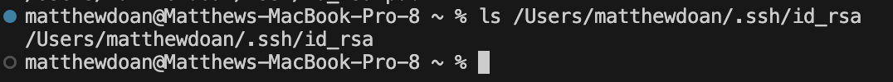
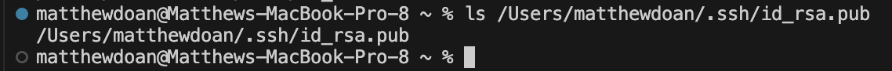
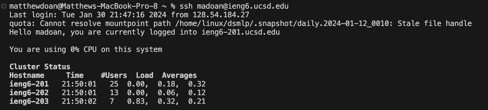

Lab Report 2
Part 1:
```
class Handler implements URLHandler {
    private String chatHistory = "";
    
    public String handleRequest(URI url) {
        if (url.getPath().equals("/add-message")) {
            String query = url.getQuery();
            if (query != null) {
                String[] queryParams = query.split("&");
                String message = "";
                String user = "";

                for (String param : queryParams) {
                    String[] keyValue = param.split("=");
                    if (keyValue[0].equals("s")) {
                        message = keyValue.length > 1 ? keyValue[1] : "";
                    } else if (keyValue[0].equals("user")) {
                        user = keyValue.length > 1 ? keyValue[1] : "";
                    }
                }

                if (!message.isEmpty() && !user.isEmpty()) {
                    chatHistory += user + ": " + message + "\n";
                }
                return chatHistory;
            } else {
                return "Invalid request. Please use /add-message?s=<message>&user=<username>";
            }
        } else {
            return "404 Not Found!";
        }
    }
}
```
When you input a message and username into the running server, the `handleRequest` method is called to process it. The `URI url` argument of this method contains the request information like the path and query parameters. The `chatHistory` field is used to store the chat history as a string; when a message is added to the `/add-message` path, `chatHistory` appends the user name and message to the existing chat history.


In the above example, when the user inputs the name "jpolitz" and the message "Hello", the `handleRequest` parses the query paramaters from the URI, and split the string into key-value pairs, checking if it matches "s" or "user" and then assigning the input strings with the appropriate variable. The `chatHistory` field is then updated by appending the user's name "jpolitz" and the message "Hello" to it, creating a new chat history entry. The `chatHistory` string is then returned. 
This process is then repeated with the name "matthew" and "Hello", "hi", and "how are you", adding to the chat history with each input.

Part 2:

Starting from the home directory, I used the `ls` command, along with the absolute path to the private key, "/Users/matthewdoan/.ssh/id_rsa", to reprint the absolute path. 


Starting from the home directory, I used the `ls` command, along with the absolute path to the public key, "/Users/matthewdoan/.ssh/id_rsa.pub", to reprint the absolute path. 


Using the `mkdir` command, I created the new directory ".ssh" onto my remote ieng6 account, which I then copied the public key into using the `scp` command. This allowed for the bypass of authentication when logging into my ieng6 account.

Part 3:
In our most recent labs, I learned about web servers and server-client interaction. I learned how to deploy and customize web servers, access them locally and remotely, and experiment with different URL paths and queries. This hands-on experience with web servers and their code gave me insight into the mechanisms of web applications and the work that goes into the powering the internet.


