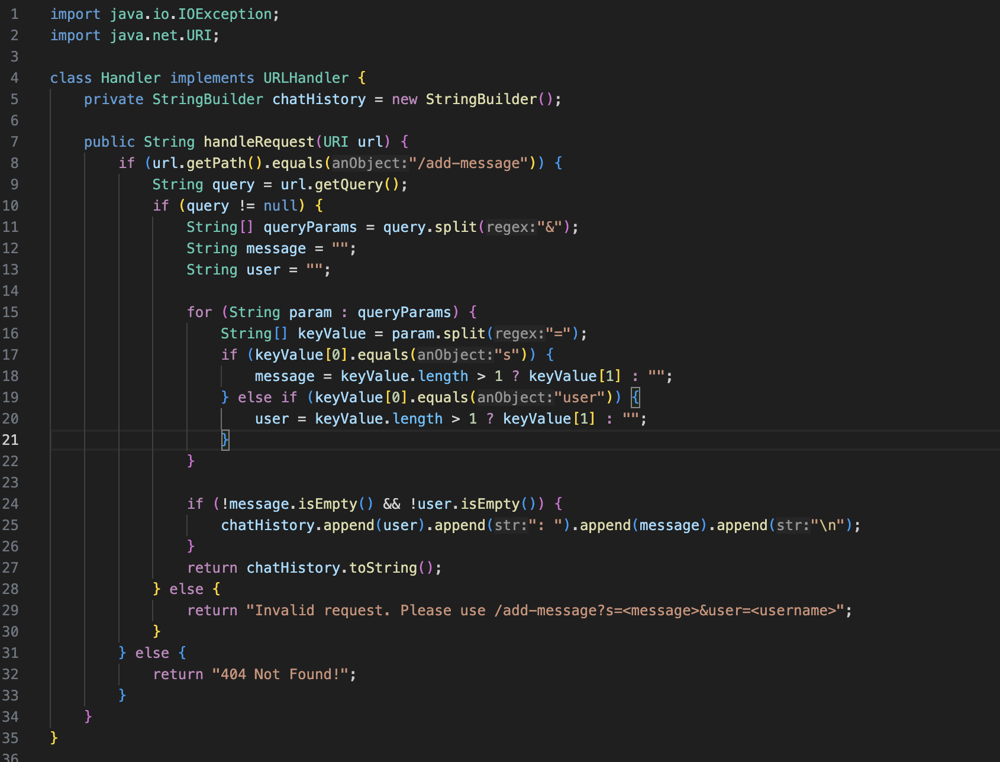

Lab Report 2

import java.io.IOException;
import java.net.URI;

class Handler implements URLHandler {
    private StringBuilder chatHistory = new StringBuilder();

    public String handleRequest(URI url) {
        if (url.getPath().equals("/add-message")) {
            String query = url.getQuery();
            if (query != null) {
                String[] queryParams = query.split("&");
                String message = "";
                String user = "";

                for (String param : queryParams) {
                    String[] keyValue = param.split("=");
                    if (keyValue[0].equals("s")) {
                        message = keyValue.length > 1 ? keyValue[1] : "";
                    } else if (keyValue[0].equals("user")) {
                        user = keyValue.length > 1 ? keyValue[1] : "";
                    }
                }

                if (!message.isEmpty() && !user.isEmpty()) {
                    chatHistory.append(user).append(": ").append(message).append("\n");
                }
                return chatHistory.toString();
            } else {
                return "Invalid request. Please use /add-message?s=<message>&user=<username>";
            }
        } else {
            return "404 Not Found!";
        }
    }
}

class ChatServer {
    public static void main(String[] args) throws IOException {
        if(args.length == 0){
            System.out.println("Missing port number! Try any number between 1024 to 49151");
            return;
        }

        int port = Integer.parseInt(args[0]);

        Server.start(port, new Handler());
    }
}
