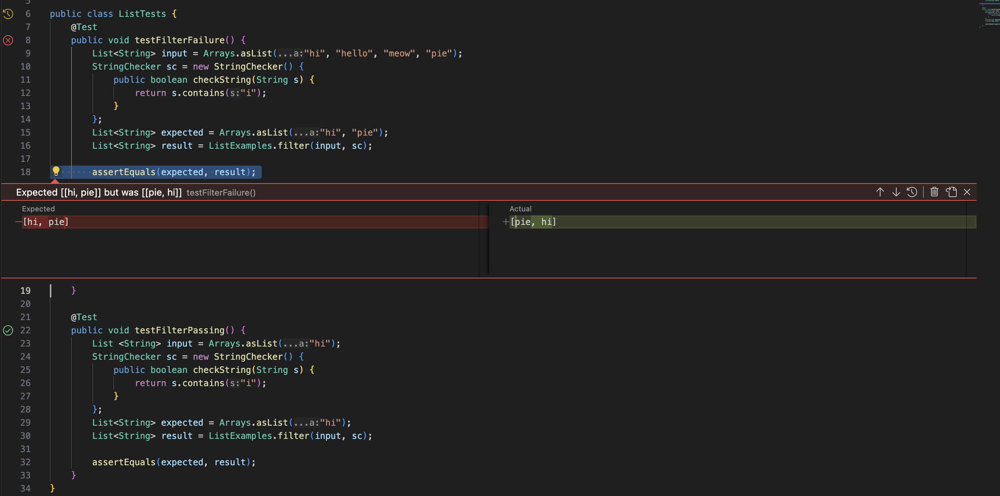

**Lab Report 3**

**Part 1:**

The filter method is supposed to return a new list that retains the elements of the input list that satisfy the StringChecker and without the elements that do not. 

**Code with bug:**

```
static List<String> filter(List<String> list, StringChecker sc) {
    List<String> result = new ArrayList<>();
    for(String s: list) {
      if(sc.checkString(s)) {
        result.add(0, s);
      }
    }
    return result;
  }
```

**Failure inducing JUnit test:**

```
@Test
    public void testFilterFailure() {
        List<String> input = Arrays.asList("hi", "hello", "meow", "pie");
        StringChecker sc = new StringChecker() {
            public boolean checkString(String s) {
                return s.contains("i");
            }
        };
        List<String> expected = Arrays.asList("hi", "pie");
        List<String> result = ListExamples.filter(input, sc);
        
        assertEquals(expected, result);
    }
```
    
With the correct code, this test should return the list ["hi", "pie"] but it returns ["pie", "hi"].

**Passing JUnit test:**

```
@Test
    public void testFilterPassing() {
        List <String> input = Arrays.asList("hi", "meow");
        StringChecker sc = new StringChecker() {
            public boolean checkString(String s) {
                return s.contains("i");
            }
        };
        List<String> expected = Arrays.asList("hi");
        List<String> result = ListExamples.filter(input, sc);
        
        assertEquals(expected, result);
    }
}
```

This test passes because there is only one string in the array with the input element, meaning it will just return ["hi"].



The bug in the code is the line `result.add(0, s);`. The code fails because as it iterates through the ArrayList, it places strings with the input element at index 0, which means the new list will return reversed instead of the original order. 

**Fixed code:**

 ```
static List<String> filter(List<String> list, StringChecker sc) {
    List<String> result = new ArrayList<>();
    for(String s: list) {
      if(sc.checkString(s)) {
        result.add(s);
      }
    }
    return result;
  }
```

By removing the 0 in `result.add(0, s);`, the code returns the elements in order of iteration rather than at the same index, ensuring that the new list is in the correct order rather than reversed. 

**Part 2:**

The `find` command is used to search for files and directories, allowing users to find files by name, type, size, etc. 

**Command-Line Options:**

**1)** `-name pattern` : This command-line option allows the user to search for files with a specific name.

    Ex 1. 
    

    matthewdoan@Matthews-MacBook-Pro-8 technical % find . -name nov1.txt
    
    ./government/Env_Prot_Agen/nov1.txt
    
 
    
    This command example searches through the technical directory and looks for the file, nov1.txt, returning the file path. This might be of use if       there are many files the user has to search through because it allows them to instantly find the path instead of looking through the directory.
    
    Ex 2.
    

    matthewdoan@Matthews-MacBook-Pro-8 technical % find . -name Media
    ./government/Media
  
    
    This command example searches through the technical directory and searches for the directory, Media, returning the path. This could be useful when
    there are directories within directories because the user does not have to manually look through them to find their needed path.
    
**2)** `-empty` : This command-line option finds any empty files and directories.

    Ex 1. 
    
    Ex 2.
    
**3)** `-print` : This command-line option displays path names for the files that match the criteria.

    Ex 1.

    Ex 2.
    
**4)** `-delete` : This command-line option deletes files that match the criteria.

    Ex 1.

    Ex 2.
    

