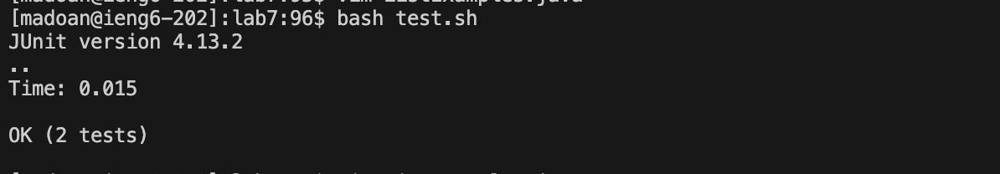
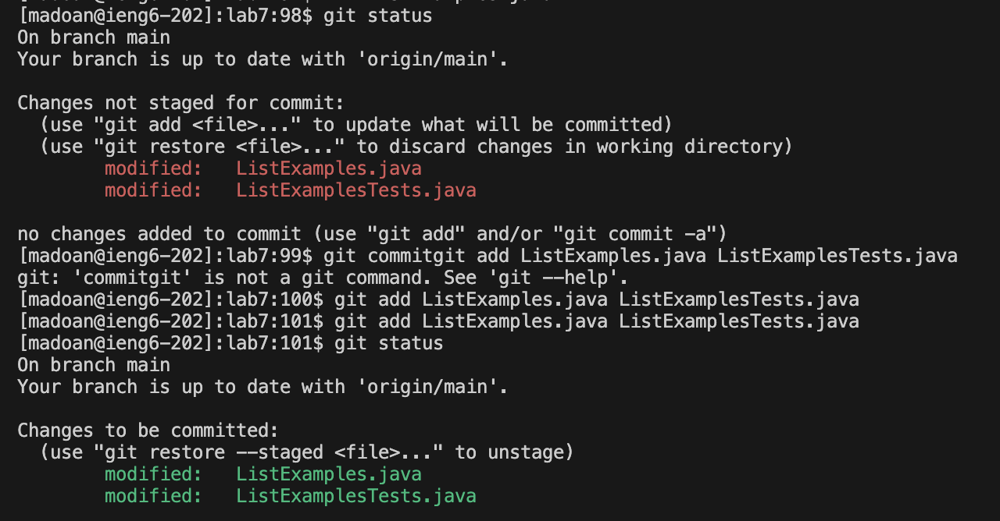
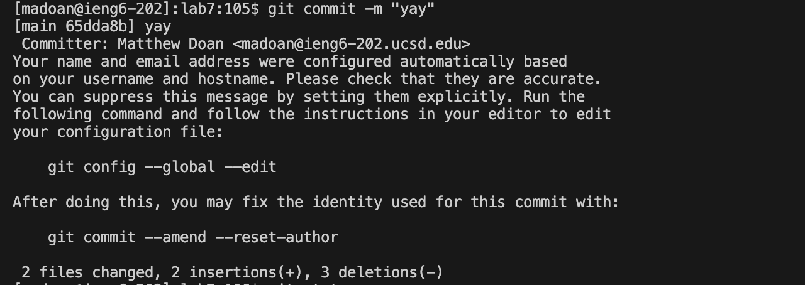

**Lab 4**

**Baseline**

**4) Log into ieng6**

I logged into ieng6 by using the `ssh` command and my ieng6 log in, typing `ssh <space> madoan@ieng6.ucsd.edu <enter>`.

**5) Clone your fork of the repository from your Github account (using the SSH URL)**

I cloned my forked repository from my Github by using the `git clone` command followed by my ssh URL, typing `git <space> clone <space> git@github.com:mattydoan/lab7.git <enter>`.

**6) Run the tests, demonstrating that they fail**

I ran the tests by using the `bash` command to run the `test.sh` shell script, typing `bash <space> test.sh <enter>`. 

**7) Edit the code file to fix the failing test**

To fix the failing test I used the `vim` command, typing `vim <space> ListExamples.java <enter>` to get into the ListExamples file. From there I typed `j j j j j j j j j j j j j j j j j j j j j j j j j j j j j j j j j j j j j j j j j j j j l l l l l l l l l l l l x <esc> i <2> <esc> <:wq> <enter>` to change index1 to index2.

**8) Run the tests, demonstrating that they now succeed**

I ran the tests by again using the `bash` command to run the `test.sh` shell script, typing `bash <space> test.sh <enter>`. This time both tests pass without failure.

**9) Commit and push the resulting change to your Github account**

First I used `git status` to check the status of my repository and see which files were modified, typing `git <space> status <enter>`.

Then I used `git add` to stage the modified files to be committed, typing `git <space> add <space> ListExamples.java <enter>`. 

From there I used `git commit` to commit the changes to my local repository, typing `git <space> commit <space> -m <space> "yay" <enter>`.

Finally I pushed the change onto my Github account typing `git <space> push <space> origin <space> main <enter>`. 

 
